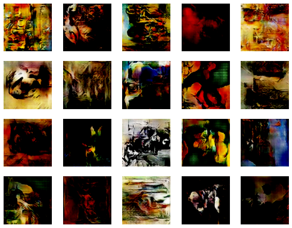

# Artwork-SSGAN

This repository is our final project in Machine Learning (EECS 738) where we construct a self supervised generative adversarial network (SSGAN) to generate works of art. This project was inspired by the work of Chen et al. in their 2019 paper [Self Supervised GAN’s via Auxiliary Rotation Loss](https://arxiv.org/pdf/1811.11212.pdf)

### Contributors:
- Ross Copeland
- Alaa Daffalla
- Anna Seib
- Karen Setiawan
- Benjamin Wyss

Our formal presentation detailing the design, implementation, and results of this work can be found [here](https://docs.google.com/presentation/d/1uUv-T4e3QHCggYfV9gejOcRy74sxb7v2sZX2igelxwQ/edit?usp=sharing)

For our dataset, we used a collection of pieces of artwork taken from the 50 most influential artists. We pulled this dataset from Kaggle on April 9, 2021 from [here](https://www.kaggle.com/ikarus777/best-artworks-of-all-time)

After building our model, we trained it for a total of 1000 epochs, resulting in the generator creating pieces of art like this:

### Repository Structure:

[images](images) hosts images from our chosen dataset sorted by artist and standardized to a 128x128 pixel red/blue/green format.

[model_images](model_images) holds images generated by our model both during and after training.

[notebooks](notebooks) hosts jupyter notebooks used to test and train models, as well as display their results. Our finalized model can be trained and tested in [ssgan.ipynb](notebooks/ssgan.ipynb).

[src](src) contains python source code related to the project including image standardization code, generative adversarial network implementations, utility functions, and test files.

[trained_models](trained_models) consists of .h5 tensorflow.keras models that were trained for 1000 epochs. Running on an Nvidia GTX 1080, one epoch takes 30 seconds of computation time. 
